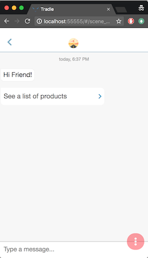

# @tradle/serverless

Welcome to Tradle, serverless! You'll find everything you need to configure and launch your own Tradle instance here.

If you're developer, you'll also see how to set up your local environment, deploy, and develop your own chatbots.

## Orientation

### Digital Identity Intro

Jump down the [rabbit hole](./docs/mythos.md)

### Serverless

This project uses the [Serverless](https://github.com/serverless/serverless) framework. `serverless.yml` file is thus the main configuration file for the cloud architecture you'll be deploying: tables, buckets, IaM roles, lambda functions, logs, alarms, pictures of kittens, etc.

You can set up a local playground, with most of the functionality of the cloud one right on your machine. To make this possible, this project uses [localstack](https://github.com/localstack/localstack) for simulating DynamoDB and S3 locally, and [serverless-offline](https://github.com/dherault/serverless-offline) + [mosca](https://github.com/mcollina/mosca) for simulating AWS's APIGateway and IoT broker, respectively.

## Setup

### Docker & Docker Compose

Docker is used during the build process, as well as in the local playground.

- [Docker for Mac](https://docs.docker.com/docker-for-mac/install/)
- [Docker for Window](https://docs.docker.com/docker-for-windows/install/)
- [Docker for Linux](https://docs.docker.com/engine/installation/#server)

- [Docker Compose](https://docs.docker.com/compose/install/) - for container orchestration and networking

### AWS cli

You'll be deploying to AWS, so you'll need an account and a command line client:

1. [Install](http://docs.aws.amazon.com/cli/latest/userguide/installing.html). On OS X, I have it installed with brew: `brew install awscli`
2. create a new IAM user with AdministratorAccess
3. Configure your settings: `aws configure`. This will set up your AWS credentials in `~/.aws/`

### Install

Install the project dependencies, and build your `serverless.yml`:

```sh
# install dependencies
npm install
# this compiles/interpolates serverless-uncompiled.yml into:
#   -> serverless-interpolated.yml 
#   -> serverless.yml
npm run build:yml
```

### Install some more tools (pre-requisite only for development)

- [redis](https://redis.io/topics/quickstart) - a key value store used by the local simulator of AWS's IoT broker. (On OS X, you can `brew install redis`)
- [jq](https://stedolan.github.io/jq/download/) - a great command line JSON parser (On OS X, you can `brew install jq`)
- [typescript](typescriptlang.org) - if you plan on doing any development (`npm i -g typescript`)  
- The [Serverless Framework](https://github.com/serverless/serverless) - this is already installed as part of `devDependencies`, but you may also want it installed globally so you can use the serverless cli (`npm i -g serverless`)

## Get Started 

### Local Playground

Note: if you don't care about playing locally and want to skip ahead to launching Tradle in the cloud, skip this section

Goal: set up an environment where we can talk to the chatbot that comes in the box, and see how we can develop our own.

#### Start docker, redis

```sh
# make sure you have docker running
docker ps
```

```sh
# run redis
redis-server
```

#### Start the Playground

The first time you start the playground, Docker will pull the necessary images, which can take a while, depending on which century your internet connection is from.

```sh
npm start
```

Now open your browser to `http://localhost:55555`. If 55555 is already your favorite port for something else, you can change the port in [./docker/docker-compose-localstack.yml](./docker/docker-compose-localstack.yml).

Profile                                    | Conversations                             | Chat
:-----------------------------------------:|:-----------------------------------------:|:-----------------------------------------:
 |  | 


### Testing 

```sh
# run tests on local resources
npm run test
# run an end-to-end test, which will creates sample business data in the process
npm run test:e2e
# browse that data via graphql
npm run test:graphqlserver
# GraphiQL is at       http://localhost:4000
# DynamoDB Admin is at http://localhost:8001
```

### Deploy

First, make sure Docker is running

```sh
# make sure docker is running
docker ps
# 1. lint & test
# 2. rebuild native modules with AWS Linux container
# 3. deploy to cloud
npm run deploy:safe
```

### Configure

There's configuration and configuration. 

- To configure the built-in bot, copy `./conf/sample-conf.json` to 

### Explore

#### List deployed resources, API endpoints, ...

```sh
npm run info # or run: serverless info

# Service Information
# service: tradle
# stage: dev
# ...
# endpoints:
#  ..
#  ANY - https://example.execute-api.us-east-1.amazonaws.com/dev/tradle/graphql
#  ANY - https://example.execute-api.us-east-1.amazonaws.com/dev/tradle/samples
#  ..
```

#### Generate sample data

If you want to play with the API, you'll first need some data. Let's generate sample data for a single user going through an application for a [Current Account](https://github.com/tradle/custom-models/blob/master/models/tradle.CurrentAccount.json)

```sh
# replace endpoint url with your own
curl -X POST --data '{"users":1,"products":["tradle.CurrentAccount"]}' \
'https://example.execute-api.us-east-1.amazonaws.com/dev/tradle/samples'
```

#### Explore the API

Open GraphiQL and play with the API

```sh
# http://localhost:4000
# https://xxxxxxx.execute-api.us-east-1.amazonaws.com/dev/tradle/graphql
# 
# sample query:
{
  rl_tradle_FormRequest {
    edges {
      node {
        _link,
        form
      }
    }
  }
}
```

#### Logging

You can use the serverless cli:

```sh
sls logs -f bot_graphql --tail
```

Or, for convenience, there's a `tail`-ish script:

```sh
npm run tail -- {function-name} {minutes-ago}
# e.g log the graphql lambda starting 5 minutes ago:
npm run tail -- bot_graphql 5
```

### Development

#### serverless.yml

If you modify `serverless-uncompiled.yml`, run `npm run build:yml` to preprocess it. Before running tests, re-run `npm run gen:localresources`

To override variables in the yml without picking a fight with git, create a `vars.yml` file in the project root. See [default-vars.yml](./default-vars.yml) for which variables you can override.

#### Code

This project is transitioning to Typescript. If you're changing any `*.ts` files, be sure you have `tsc -w` running to transpile to Javascript on the fly.

##### Hot re-loading

Thanks to [serverless-offline](https://github.com/dherault/serverless-offline), changes made to the codebase will hot-reload, which makes development that much sweeter.

### Destroy

Sometimes you want to wipe the slate clean and start from scratch (usually by age 25 or so). The following command will wipe out all the AWS resources created in your deployment. Obviously, use with EXTREME caution, as this command executes with your AWS credentials (best use a separate account).

```sh
npm run nuke
# a series of y/n prompts ensues, 
# ensuring you're committed to the destruction of all that is holy
```

### Directory Structure

```sh
./
  serverless-uncompiled.yml # gets pre-processed into serverless.yml by `npm run build:yml`
  scripts/                  # command line scripts, and utils
  conf/                     # configuration for your instance
  lib/
    bot/                    # bot engine
  samplebot/                # currently co-located sample bot that uses tradle/bot-products#modeled
```

### Troubleshooting

If you see errors like the one below, it means `localstack` is not up. Launch `localstack` with `npm run localstack:start`

```sh
# Error: connect ECONNREFUSED 127.0.0.1:4569
# ...
```

If tests are failing with errors like the one below, it means you need to generate local resources on `localstack`. Run `npm run gen:localresources`

```sh
# ResourceNotFoundException: Cannot do operations on a non-existent table
# ...
```

If tests are failing for some other reason, you may want to run
```sh
npm run reset:local # delete + regen local dbs, buckets, etc.
```

### Scripts

#### npm run localstack:start

#### npm run localstack:stop

Note: running this destroys your playground's tables and buckets

#### npm run localstack:restart

Note: running this destroys your playground's tables and buckets

#### generate local resources (tables, buckets), local identity

Note: running this destroys your playground's identity, and creates a new one

#### npm run reset:local

delete and recreate local resources (tables, buckets, identity)

#### npm run deploy:safe

lint, run tests, rebuild native modules for the AWS Linux Container, and deploy

#### npm run test:e2e

run an end-to-end simulated interaction between a bot, customer, and employee. This is useful for later exploration of the data created in graphql (`npm run test:graphqlserver`)

#### npm run test:graphqlserver

start up two UIs for browsing local data:
- a DynamoDB Admin interface
- GraphiQL

#### npm run setstyle

To set the style of your provider, refer to the [StylesPack](https://github.com/tradle/models/blob/master/models/tradle.StylesPack.json) model. Set it in the "style" property in `conf/{service}.json`
