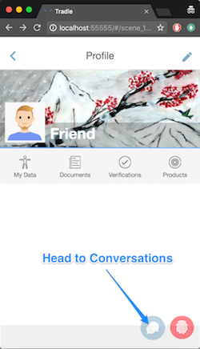
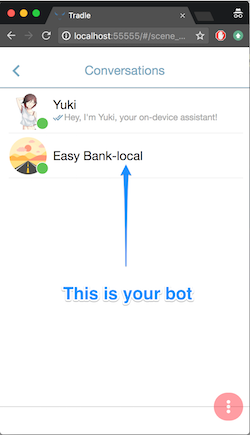
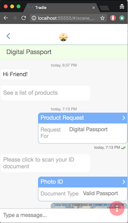

# @tradle/serverless

Welcome to Tradle serverless / Tradle MyCloud! You'll find everything you need to configure and launch your own Tradle instance here.

If you're developer, you'll also see how to set up your local environment, deploy, and develop your own chatbots.

<!-- START doctoc generated TOC please keep comment here to allow auto update -->
<!-- DON'T EDIT THIS SECTION, INSTEAD RE-RUN doctoc TO UPDATE -->


- [Orientation](#orientation)
  - [Digital Identity Intro](#digital-identity-intro)
- [Setup](#setup)
  - [Tools](#tools)
    - [Git](#git)
    - [Node.js](#nodejs)
    - [Docker & Docker Compose](#docker-&-docker-compose)
    - [AWS cli](#aws-cli)
    - [JQ](#jq)
  - [Development Tools](#development-tools)
  - [Clone this project](#clone-this-project)
  - [Install dependencies](#install-dependencies)
  - [Set AWS profile](#set-aws-profile)
- [Local Playground](#local-playground)
  - [Start docker](#start-docker)
  - [Start the Playground](#start-the-playground)
  - [Explore the API](#explore-the-api)
  - [AWS cli (local)](#aws-cli-local)
  - [Generate sample data](#generate-sample-data)
- [Deploy to AWS](#deploy-to-aws)
  - [Configure](#configure)
  - [Explore the Architecture](#explore-the-architecture)
    - [List deployed resources, API endpoints, ...](#list-deployed-resources-api-endpoints-)
- [Development](#development)
  - [serverless.yml](#serverlessyml)
  - [Testing](#testing)
  - [Hot re-loading](#hot-re-loading)
  - [Logging](#logging)
- [Destroy](#destroy)
- [Troubleshooting](#troubleshooting)
- [Scripts](#scripts)
  - [npm run localstack:start](#npm-run-localstackstart)
  - [npm run localstack:stop](#npm-run-localstackstop)
  - [npm run localstack:restart](#npm-run-localstackrestart)
  - [npm run gen:localstack](#npm-run-genlocalstack)
  - [npm run gen:localresources](#npm-run-genlocalresources)
  - [npm run nuke:local](#npm-run-nukelocal)
  - [npm run reset:local](#npm-run-resetlocal)
  - [npm run deploy:safe](#npm-run-deploysafe)
  - [npm run test:e2e](#npm-run-teste2e)
  - [npm run test:graphqlserver](#npm-run-testgraphqlserver)
  - [npm run graphqlserver](#npm-run-graphqlserver)
  - [npm run setstyle](#npm-run-setstyle)
  - [npm run setconf](#npm-run-setconf)
  - [warmup](#warmup)
- [Project Architecture](#project-architecture)
  - [Tools](#tools-1)
  - [Directory Structure](#directory-structure)
  - [Main Components](#main-components)
    - [Core Tables](#core-tables)
    - [Buckets](#buckets)
    - [Functions](#functions)
    - [Network communication flow](#network-communication-flow)
    - [Plugins](#plugins)
    - [Email templates](#email-templates)

<!-- END doctoc generated TOC please keep comment here to allow auto update -->

## Orientation

### Digital Identity Intro

Jump down the [rabbit hole](./docs/mythos.md)

## Setup

First, install some tools

### Tools

#### Git

Make sure you have `git` installed. If you're on `OS X`, you already have it.

#### Node.js

The following are the versions used by the Tradle dev team:

- Node.js@[6.10.3](https://nodejs.org/download/release/v6.10.3/) - this is the version used by Amazon for AWS Lambda. Yes, you can use the latest Node.js instead, but keep this in mind if you hit errors.  
- npm@3.10.10

#### Docker & Docker Compose

Docker is used during the build process, as well as in the local playground. Docker Compose is used for container orchestration and networking

1. Docker  
  a. [OS X](https://docs.docker.com/docker-for-mac/install/)  
  b. [Window](https://docs.docker.com/docker-for-windows/install/)  
  c. [Linux](https://docs.docker.com/engine/installation/#server)  
2. [Docker Compose](https://docs.docker.com/compose/install/)

Make sure you can run docker as non-root. On Linux, you can do this by adding your user to the `docker` group with: `sudo gpasswd -a $USER docker`

#### AWS cli

You'll be deploying to AWS, so you'll need an account and a command line client:

1. [Install](http://docs.aws.amazon.com/cli/latest/userguide/installing.html). On OS X, I have it installed with brew: `brew install awscli`
2. create a new IAM user with AdministratorAccess
3. Configure your settings: `aws configure` or `aws configure --profile <profileName>`. This will set up your AWS credentials in `~/.aws/`

#### JQ 

[jq](https://stedolan.github.io/jq/download/) is a great command line JSON parser (On OS X, you can `brew install jq`)

### Development Tools

*Note: if you don't care about playing locally and want to skip ahead to deploying Tradle MyCloud to the cloud, skip this section*

- [awslocal](https://github.com/localstack/awscli-local). aws-cli wrapper for querying localstack. (On OS X, install with `[sudo] pip install awscli-local`)
- [typescript](typescriptlang.org) - if you plan on doing any development (`npm i -g typescript`)  
- [Serverless Framework](https://github.com/serverless/serverless) - this is already installed as part of `devDependencies`, but you may also want it installed globally so you can use the serverless cli (`npm i -g serverless`)

### Clone this project

Clone this project. The rest of setup below takes place in the cloned repository's root folder.

### Install dependencies

```sh
# install dependencies
npm install
```

### Set AWS profile

If you ran `aws configure --profile <profileName>` and not `aws configure`, open `vars.yml` and add a line:

```yaml
...
profile: <profileName>
...
```

## Local Playground

*Note: if you don't care about playing locally and want to skip ahead to deploying Tradle MyCloud to the cloud, skip this section*

Goal: set up an environment where we can talk to the chatbot that comes in the box, and see how we can develop our own.

### Start docker

```sh
# make sure you have docker running
docker ps
```

### Start the Playground

The first time you start the playground, Docker will pull the necessary images from [Docker Hub](https://hub.docker.com), which can take a while, depending on which century your internet connection is from.

```sh
npm start
```

Now open your browser to [http://localhost:55555](http://localhost:55555). If 55555 is already your favorite port for something else, you can change the port in [./docker/docker-compose-localstack.yml](./docker/docker-compose-localstack.yml).

Profile                                    | Conversations                             | Chat
:-----------------------------------------:|:-----------------------------------------:|:-----------------------------------------:
 |  | 

### Explore the API

After you chat with the bot a bit, open up GraphiQL at [http://localhost:21012](http://localhost:21012) and play with the API:

```sh
# http://localhost:21012
# 
# sample query:
{
  rl_tradle_ProductRequest {
    edges {
      node {
        _author,
        _time,
        _link,
        requestFor
      }
    }
  }
}
```

You can also browse the database via the DynamoDB Admin at [http://localhost:8001](http://localhost:8001)

When you deploy to the cloud, GraphiQL will be available at https://xxxxxxx.execute-api.us-east-1.amazonaws.com/dev/tradle/graphql

### AWS cli (local)

The local endpoints for localstack are enumerated in their docs (or see [./src/test/localstack.json](./src/test/localstack.json)). To query them using the AWS cli, specify an additional `--endpoint` option, e.g.:

```sh
aws dynamodb list-tables --endpoint http://localhost:4569
aws s3 ls --endpoint http://localhost:4572
```

### Generate sample data

If you want to play with the API, you'll first need some data. Let's generate sample data for a single user going through an application for a [Current Account](https://github.com/tradle/custom-models/blob/master/models/tradle.CurrentAccount.json)

```sh
echo '{"users":1,"products":["tradle.CurrentAccount"]}' | serverless invoke -f bot_samples
```

## Deploy to AWS

First, make sure Docker is running

```sh
# make sure docker is running
docker ps
# 1. lint & test
# 2. rebuild native modules with AWS Linux container
# 3. deploy to cloud
npm run deploy:safe
```

Deployment can take ~5-10 minutes.

Once everything's deployed, open your browser to [https://app.tradle.io](https://app.tradle.io). On the Conversations page, click the red button, and choose Add Server URL. Paste in your API endpoint (it looks like https://xxxxxxx.execute-api.us-east-1.amazonaws.com/dev/)

### Configure

There's configuration and configuration. 

- To change the name/domain/logo of your bot, edit `./vars.yml`. Then run `npm run build:yml`
- If you'd like to write your own bot, for now the easier way to do it is directly in your cloned tradle/serverless repo. Check out the built-in bot in: [./in-house-bot/index.js](./in-house-bot/index.js).

### Explore the Architecture

#### List deployed resources, API endpoints, ...

```sh
npm run info # or run: serverless info

# Service Information
# service: tradle
# stage: dev
# ...
# endpoints:
#  ..
#  ANY - https://example.execute-api.us-east-1.amazonaws.com/dev/tradle/graphql
#  ANY - https://example.execute-api.us-east-1.amazonaws.com/dev/tradle/samples
#  ..
```

## Development

Note: this project is transitioning to Typescript. If you're changing any `*.ts` files, be sure you have `tsc -w` running to transpile to Javascript on the fly.

### serverless.yml

If you modify `serverless-uncompiled.yml`, run `npm run build:yml` to preprocess it. Before running tests, re-run `npm run gen:localresources`

To override variables in the yml without picking a fight with git, create a `vars.yml` file in the project root. See [default-vars.yml](./default-vars.yml) for which variables you can override.

### Testing

```sh
# run tests on local resources
npm run test
# run an end-to-end test, which creates sample business data in the process
npm run test:e2e
# browse that data via graphql
npm run test:graphqlserver
# GraphiQL is at       http://localhost:21012
# DynamoDB Admin is at http://localhost:8001
```

### Hot re-loading

Thanks to [serverless-offline](https://github.com/dherault/serverless-offline), changes made to the codebase will hot-reload, which makes development that much sweeter.

### Logging

You can use the serverless cli:

```sh
sls logs -f bot_graphql --tail
```

Or, for convenience, there's a `tail`-ish script:

```sh
npm run tail -- {function-name} {minutes-ago}
# e.g log the graphql lambda starting 5 minutes ago:
npm run tail -- bot_graphql 5
```

## Destroy

Sometimes you want to wipe the slate clean and start from scratch (usually by age 25 or so). The following command will wipe out all the AWS resources created in your deployment. Obviously, use with EXTREME caution, as this command executes with your AWS credentials (best use a separate account).

```sh
npm run nuke
# a series of y/n prompts ensues, 
# ensuring you're committed to the destruction of all that is holy
```

## Troubleshooting

**Symptom**:

```sh
# Error: connect ECONNREFUSED 127.0.0.1:4569
# ...
```

**Cause**: `localstack` is not up. 
**Fix**: `npm run localstack:start`  

**Symptom**:

```sh
# ResourceNotFoundException: Cannot do operations on a non-existent table
# ...
```

**Cause**: you haven't generated local resources (tables, buckets, etc.)  
**Fix**: run `npm run gen:localresources`  

**Symptom**: tests fail, you don't know why
**Cause**: to be determined
**Fix**: `npm run reset:local # delete + regen local resources (tables, buckets, etc.)`

**Symptom**: 

```sh
Serverless command "<some command>" not found
```

**Cause**: your `serverless.yml` is corrupted. `build:yml` probably failed the last time you ran it. Fix: fix `serverless-uncompiled.yml`, make sure `build:yml` completes successfully before retrying

**Symptom**:

```sh
still haven't connected to local Iot broker!
```

**Cause**: to be determined  
**Fix**: `npm run fix:redis`

## Scripts

### npm run localstack:start

start DynamoDB and S3 in a Docker

### npm run localstack:stop

stop local DynamoDB and S3

### npm run localstack:restart

restart local DynamoDB and S3

### npm run gen:localstack

generate local DynamoDB tables and S3 buckets

### npm run gen:localresources

generate local tables, buckets, identity and keys

### npm run nuke:local

delete local tables, buckets, identity and keys

### npm run reset:local

delete and recreate local resources (tables, buckets, identity)

### npm run deploy:safe

lint, run tests, rebuild native modules for the AWS Linux Container used by AWS Lambda, and deploy to AWS

### npm run test:e2e

run an end-to-end simulated interaction between a bot, customer, and employee. This is useful for later exploration of the data created in graphql (`npm run test:graphqlserver`)

### npm run test:graphqlserver

start up two UIs for browsing local data:
- a DynamoDB Admin interface
- GraphiQL

### npm run graphqlserver

starts up GraphiQL for querying remote data

### npm run setstyle

DEPRECATED (use https://github.com/tradle/configure-tradle)

To set the style of your provider, refer to the [StylesPack](https://github.com/tradle/models/blob/master/models/tradle.StylesPack.json) model. Set it in the "style" property in `./conf/provider.json`

### npm run setconf

DEPRECATED (use https://github.com/tradle/configure-tradle)

Update the style and/or bot configuration of your provider

### warmup

- warm up all functions with: `serverless warmup run`
- warm up a subset of functions with `serverless warmup run -f [function1] -f [function2] -c [concurrency]`
- estimate cost of warm ups: `serverless warmup cost`

## Project Architecture

### Tools

This project uses the [Serverless](https://github.com/serverless/serverless) framework. `serverless.yml` file is thus the main configuration file for the cloud architecture you'll be deploying: tables, buckets, IaM roles, lambda functions, logs, alarms, pictures of kittens, etc.

You can set up a local playground, with most of the functionality of the cloud one right on your machine. To make this possible, this project uses [localstack](https://github.com/localstack/localstack) for simulating DynamoDB and S3 locally, and [serverless-offline](https://github.com/dherault/serverless-offline) + [mosca](https://github.com/mcollina/mosca) for simulating AWS's APIGateway and IoT broker, respectively.

### Directory Structure

```sh
./
  serverless-uncompiled.yml # npm run build:yml turns this into:
                            #   -> serverless-interpolated.yml 
                            #   -> serverless-compiled.yml
                            #   -> serverless.yml
  vars.yml                  # your provider's name/domain/logo, as well as dev env opts
  src/                      # typescript code, some shell scripts
    *.ts
    scripts/                # command line scripts, and utils
    bot/                    # bot engine
    in-house-bot/              # currently co-located sample bot  tradle/bot-products#modeled
    test/
  lib/                      # transpiled JS code
```

### Main Components

Below you'll find the description of the various architecture components that get created when the stack is deployed.

#### Core Tables

you'll typically see the tables prefixed per the servless convention, [service]-[stage]-[name] e.g. the `presence` table is `tradle-dev-presence` on the `dev` stage

- `pubkeys`: maps public keys to identities that control them
- `presence`: Iot client sessions
- `seals`: tracks blockchain seals for objects, watches placed on expected seals, and seals queued for write
- `inbox`: inbound messages from users
- `outbox`: outbound messages to users
- `users`: user state objects
- `friends`: known Tradle/MyCloud nodes
- `events`: master log, which due to performance issues, is ironically written to post-fact
- `bucket-[x]`: tables that store resources created from Tradle models, e.g. tradle.Application, tradle.PhotoID, tradle.MyLifeInsurance, tradle.FormRequest. Each table stores multiple types, and types are mapped deterministically to a table "bucket". Anything that gets put in inbox/outbox also ends up stored and indexed here. The GraphQL API reads from here.
- `kv`: undifferentiated key/value store where you can store application and system-level configuration values. Currently stores push notification subscription information, and various temporary values.

#### Buckets

- `ObjectsBucket`: stores all objects send/received to/from users
- `SecretsBucket`: if I told you, I'd have to kill you. It stores the private keys for your MyCloud's identity.
- `PublicConfBucket`: probably won't be around much longer, but currently stores the pulic identity file
- `PrivateConfBucket`: may be renamed to ConfBucket soon. It stores public/private configuration like: identity, styles, and bot plugin configuration files
- `ContentAddressedBucket`: content-addressed storage, usable by bots. Use via `bot.contentAddressedStorage`. Not used much so far, may go away in favor of a path in `PrivateConfBucket`
- `FileUploadBucket`: because Lambda and IoT message-size limits, any media embedded in objects sent by users is first uploaded here

#### Functions

- `warmup`: keeps lambda containers warm to prevent cold start. Concurrency is configurable
- `preauth` (HTTP): generates temporary credentials (STS) for new connections from users, attaches the IotClientRole to them, creates a new session in the `presence` table (still `unauthenticated`). Generates a challenge to be signed (verified in `auth`) \*
- `auth` (HTTP): verifies the challenge, marks the session as authenticated \*
- `onconnect` (IoT): updates the user's session. If the user is already subscribed to the right MQTT topics, attempts to deliver queued up messages depending on the user's announced send/receive position
- `ondisconnect` (IoT): updates the user's session, marks the user as disconnected
- `onsubscribe` (IoT): updates the user's session. If the user is already connected, attempts to deliver messages depending on the user's announced send/receive position
- `onmessage` (IoT): processes inbound messages from the user. Pending validation, stores the object in `ObjectsBucket` and passes the message off to the `bot_onmessage` lambda. *Note: currently the bot_onmessage lambda is run in-process, rather than invoked through AWS Lambda*
- `onmessage_http` (HTTP): (DEPRECATED in favor of `inbox`) same as `onmessage`, but HTTP, so it has a higher maximum payload size.
- `inbox` (HTTP): receives batches of inbound messages (typically from other MyCloud's)
- `to-events`: replicates streams from `inbox`/`outbox`/`seals` tables to the `events` table
- `addfriend`: add a known MyCloud to the `friends` table, so outbound messages can be delivered to them
- `info` (HTTP): get the public information about this MyCloud - the identity, style, logo, country, currency, etc.
- `bot_oninit`: initialize the MyCloud node - generate an identity and keys, save secrets and default configuration files to respective buckets. Should really be named `init` or `oninit`, but good luck getting AWS to rename something.
- `sealpending` (scheduled): write queued seals to the blockchain
- `pollchain` (scheduled): query unconfirmed seals
- `setstyle`: update the style
- `onmessage`: where your bot (business logic) processes inbound messages
- `onsealevent`: where your bot (business logic) processes seal events (reads/writes)
- `onmessagestream`: where the bot engine replicates sent/received data to tables (see `bucket-x` in Tables)
- `graphql`: your bot's built-in graphql API that supports existing Tradle models and custom ones you add.
- `samples`: generates a bunch of sample data. Hasn't been tested in a looooong time, so use it if you want to fix it.

\* Note: the purpose of authentication is to know whether to send the user messages from the `outbox` table. Inbound messages don't require pre-authentication, as they are all signed.

#### Network communication flow

1. client (Tradle mobile/web app) calls `/preauth` (`preauth` lambda) and gets a temporary identity via AWS STS. It also gets a challenge to sign.
1. client calls `/auth` with the signed challenge. At this point MyCloud deems it safe to send the client any queued up messages, and will start doing so.
1. client subscribes to AWS Iot topics restricted to its temporary identity's namespace. This allows it to receive messages, acks and errors from MyCloud. MyCloud receives these Iot lifecycle events (connect, disconnect, subscribe) in Lambda, and updates the client's session information (`iotlifecycle` lambda).
1. the client and MyCloud can send each other messages via AWS Iot.

#### Plugins

See [./docs/plugins.md](./docs/plugins.md)

#### Email templates

To prerender templates (primarily to inline css), run `npm run prerender:templates`
